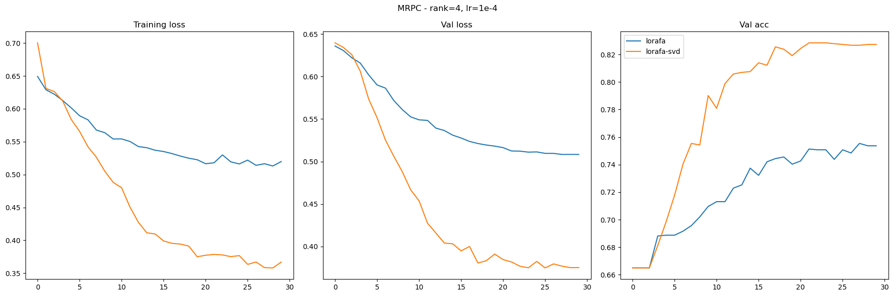
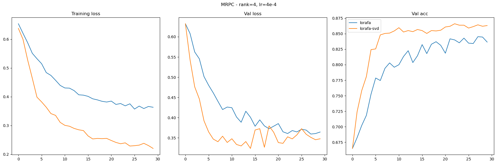
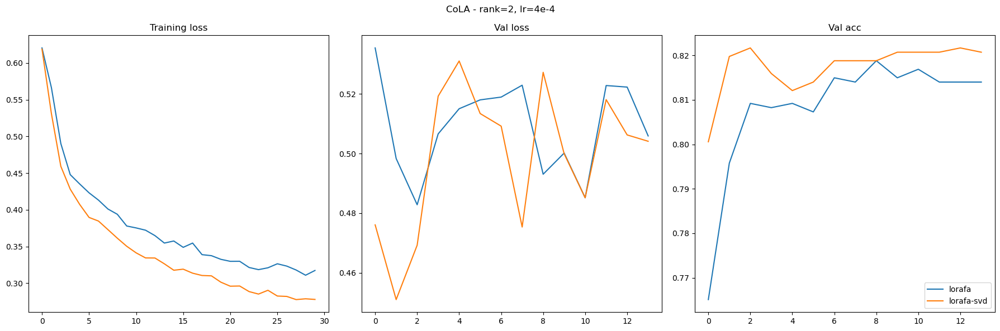
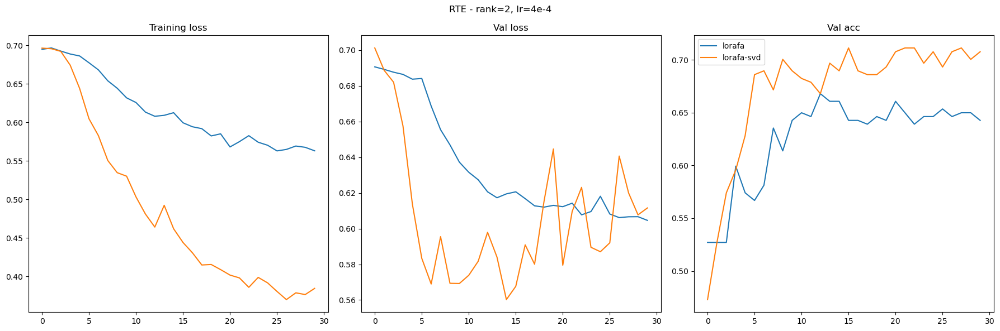

# Final project for "Numerical Linar Algebra" master's course

### Abstract

LoRA - Low Rank Adaptation of LLM - is one of the most popular methods for efficient fine-tuning of Large Language Models without need for training all of it's parametrs. One of it's most recent modifications - LoRA-FA is a memory efficient extension of the method, which allows to reduce memory cost around x1.4 times. However both LoRA and LoRA-FA rely on random initialization of matrix A and initialization with zeros of matrix B. In our project compare LoRA-FA paper approach to our extension of method.


Our contribution is that we try to observe more efficient loss/metric convergence while training from better initial low-rank weights obtained via low-rank approximation of initial $W$ via simple singular value decomposition.

We experiment with RoBERTa-base model (150 M. parameterse) on several datasets from GLUE (MRPC, RTE, COLA) and observe dynamics of metrics and losses of standard LoRA-FA vs our initialized with SVD. We also experiment with additional regularization (see corresponding notebook).

### Structure

- files named ```*_experiment.ipynb``` contain main experiments, which produce resulting logs in ```\logs``` folder with loss and accuracy history
- ```\lora``` contains module based of one implemented in [minLoRA](https://github.com/cccntu/minLoRA) and modified for project needs
- other files are either utility or tests of functionality 


### Datasets from article
"CoLA":'https://dl.fbaipublicfiles.com/glue/data/CoLA.zip',

"SST":'https://dl.fbaipublicfiles.com/glue/data/SST-2.zip',

"QQP":'https://dl.fbaipublicfiles.com/glue/data/STS-B.zip',

"STS":'https://dl.fbaipublicfiles.com/glue/data/QQP-clean.zip',

"MNLI":'https://dl.fbaipublicfiles.com/glue/data/MNLI.zip',

"QNLI":'https://dl.fbaipublicfiles.com/glue/data/QNLIv2.zip',

"RTE":'https://dl.fbaipublicfiles.com/glue/data/RTE.zip',

"WNLI":'https://dl.fbaipublicfiles.com/glue/data/WNLI.zip',

"diagnostic":'https://dl.fbaipublicfiles.com/glue/data/AX.tsv'

### How to run

In order to successfully run notebooks in environment, one is expected to have installed latest ```pytorch```, ```transformers``` and ```datatsets``` libraries, as well as other standard dependencies like ```numpy```, ```matplotlib``` and ```jupyter notebook``` (as well as other imports in notebooks that didn't end up being mentioned here :)). 

With all dependencies installed one can run experiment notebooks (or demo ones) and follow instructions described there.


### Results

As a result of many experiments, we observe clear superiority of low-rank SVD initialization of AB - in training regimes with smaller learning rates they converge always faster and to better quality, while with greater LR (~0.005) quality and speed becomes comparable (bu still with noticable gap).

Some plots with our results (you can visit ```plots_for_preso.ipynb``` to see more of them):






### References

1. LoRA paper - [link](https://arxiv.org/abs/2106.09685)
2. LoRA-FA paper - [link](https://arxiv.org/abs/2308.03303)

### Authors

1. Sergey Karpukhin, [@hr3nk](https://github.com/shredder67)
2. Yulia Sergeeva, [@SergeevaJ](https://github.com/SergeevaJ)
3. Pavel Bartenev, [@PavelBartenev](https://github.com/PavelBartenev)
4. Pavel Tikhomirov, [@ocenandor](https://github.com/ocenandor)
5. Maksim Komiakov, [@kommaks](https://github.com/kommaks)
